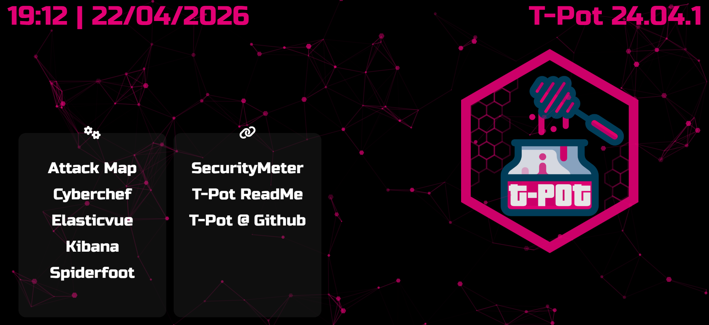
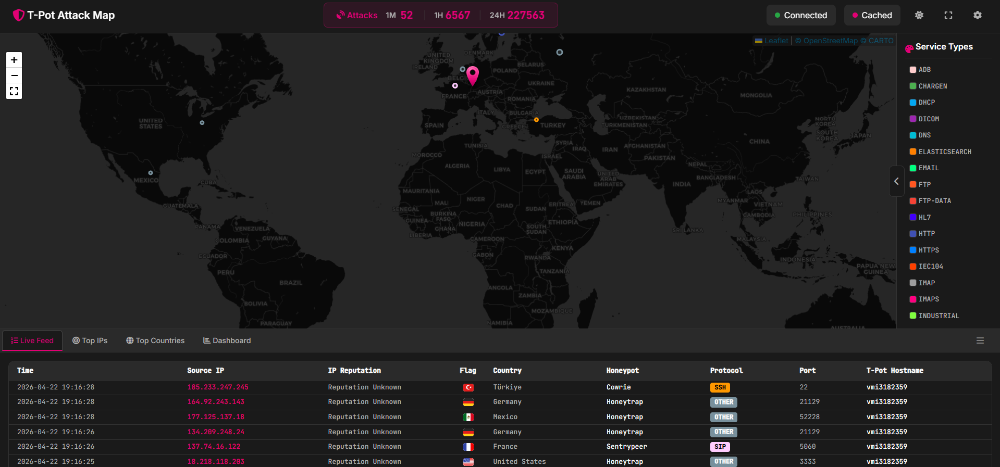
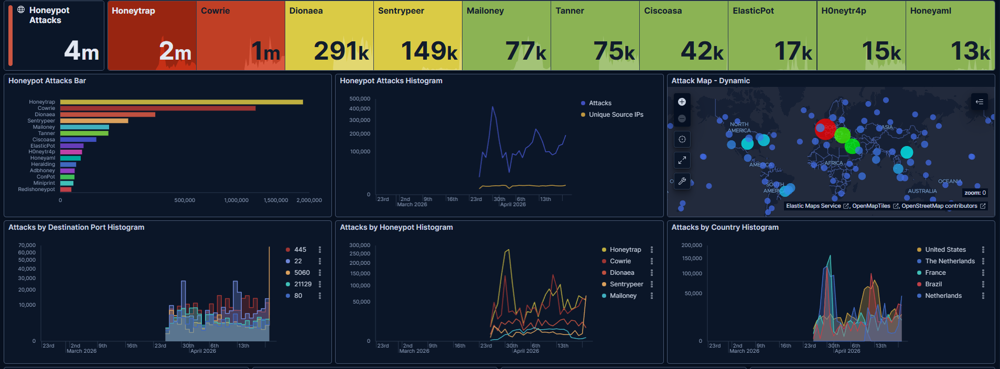

# Honeypot Threat Analysis Lab

## About This Project

In this project, I set up a honeypot environment using T-Pot and monitored real attack traffic from the internet.

My goal was to understand how real-world attacks work and improve myself in cybersecurity by analyzing this data.

## What I Did

- Installed T-Pot on a Contabo VPS
- Ran multiple honeypots (Cowrie, Dionaea, etc.)
- Collected real attack traffic
- Monitored attacks using Kibana dashboards
- Analyzed incoming attacks

## Real Traffic

The system was exposed to the internet to observe real attack behavior.

During this project:

- I observed more than 3 million attack attempts
- Attacks came from different countries
- SSH brute-force and automated scans were very common

All data is real and no simulation was used.

## What I Observed

- Most attacks target SSH (port 22)
- Continuous brute-force attempts
- Heavy scanning on web ports (80/443)
- Most attacks are automated bots

## Screenshots

### Dashboard

### Attack Map

### Statistics

## Technologies I Used

- T-Pot
- Docker & Docker Compose
- Elastic Stack (Elasticsearch, Logstash, Kibana)
- Ubuntu Linux

## Setup

bash
git clone https://github.com/yourusername/honeypot-project.git
cd honeypot-project
docker-compose up -d

## Note

Sensitive data such as real IP addresses and credentials have been removed.

## Goal

This project helped me understand real attack traffic and build a base for future security projects.
